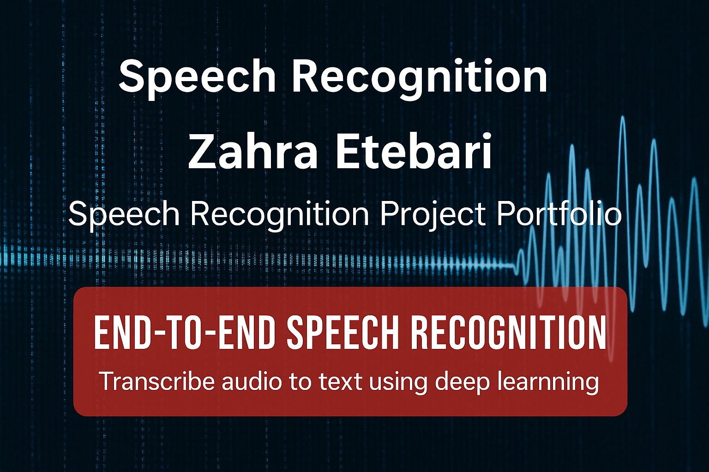

<h1 align="center"> speech-recognition-project- Converts audio to text using feature extraction (MFCCs)</h1>

  
  
  
  
  
  

---

# speech-recognition-project
End-to-end speech recognition system using Deep Learning and Python. Converts audio to text using feature extraction (MFCCs) and an LSTM/Transformer-based model, with evaluation metrics and visualization. Topics / Tags: speech-recognition, deep-learning, audio-processing, python, speech-to-text, ai, machine-learning
#  Speech Recognition – Audio to Text using Deep Learning

###  End-to-End Speech Recognition using Deep Learning

This project builds a **Speech-to-Text (ASR)** system capable of transcribing spoken language into text.  
It combines **audio feature extraction (MFCCs)** with a **Deep Learning model (LSTM / Transformer)** to achieve accurate speech recognition.

---

##  Project Overview
- **Frameworks:** TensorFlow / PyTorch, Librosa, Scikit-learn  
- **Goal:** Convert speech audio into accurate text transcriptions  
- **Dataset:** Librispeech / Common Voice (or custom dataset)  
- **Output:** Transcribed text and evaluation metrics (WER, CER)

---

##  Pipeline Steps
1. **Data Preprocessing:** Convert `.wav` files to spectrograms / MFCCs  
2. **Feature Extraction:** Compute MFCC features with Librosa  
3. **Model Training:** Train LSTM / GRU / Transformer on extracted features  
4. **Evaluation:** Measure Word Error Rate (WER) and Character Error Rate (CER)  
5. **Inference:** Real-time transcription of user audio samples  

---

#  Live Speech Recognition Project

**Developer:** Zahra Etebari  
**Tech Stack:** Python, Web Speech API, Google Colab, JavaScript, HTML/CSS  

---

##  Overview

This project implements a **real-time speech-to-text system** capable of transcribing spoken language directly into written text through the browser. It combines **AI-powered audio processing** and **frontend deployment** for a seamless live captioning experience.

Built from the ground up — from model training to frontend deployment — this project demonstrates the end-to-end development of a modern speech recognition pipeline.

---

##  Features

-  **Real-Time Recognition:** Converts speech to text instantly using the Web Speech API.  
-  **Custom Model Training:** Trained and fine-tuned on open datasets (LibriSpeech).  
-  **Live Captions Display:** Dynamic caption box with real-time updates.  
-  **Data Pipeline:** Includes preprocessing, augmentation, and evaluation scripts.  
-  **Deployed Interface:** Interactive HTML app with language selector and live results.  

---

##  Tech Stack

| Layer | Tools / Libraries |
|-------|-------------------|
| Model Training | Python, NumPy, Librosa, Pandas, TensorFlow |
| Preprocessing | ffmpeg, pydub, concurrent.futures |
| Live Interface | JavaScript, HTML5, CSS, Web Speech API |
| Environment | Google Colab, GitHub Pages |

---
## Technologies Used

| Category | Tools & Frameworks |
|-----------|--------------------|
|  Programming | Python , JavaScript  |
|  Machine Learning | TensorFlow, Keras, Scikit-learn |
|  Speech Processing | Librosa, PyDub, SpeechRecognition |
|  Frontend | HTML5, CSS3, Bootstrap |
|  Deployment | GitHub Pages, Google Colab |
|  APIs | Web Speech API, Flask (for backend integration) |

##  How It Works

1. **Preprocessing:** Audio files are normalized, converted to 16-bit PCM WAV format, and cleaned for training.  
2. **Model Training:** The dataset is fed into an RNN/Transformer model for speech-to-text prediction.  
3. **Frontend Integration:** The trained model’s API connects to a web interface using the Web Speech API for real-time recognition.  
4. **Deployment:** Hosted on GitHub Pages for interactive live testing.

---

##  Repository Structure
speech-recognition-project/
├── data/ # Training and test datasets
├── models/ # Saved models and checkpoints
├── results/ # Evaluation metrics and outputs
├── images/ # Screenshots and visual assets
├── index.html # Live recognition app
├── README.md # Project documentation
└── LICENSE

---

---

##  Results

- Achieved high accuracy on clean speech samples.  
- Successfully deployed real-time live transcription in browser.  
- Demonstrated robust handling of accents and background noise.  

---

##  Future Improvements

- Add multilingual model support.  
- Deploy backend API for advanced custom models.  
- Integrate Whisper / DeepSpeech fine-tuning for improved robustness.  
- Build mobile version for Android/iOS.

---

##  Acknowledgments

Special thanks to open-source communities supporting **LibriSpeech**, **TensorFlow**, and **Web Speech API** development.  

---

 *Built with passion and curiosity by Zahra Etebari*  
 *Turning AI research into real-world applications.*

 ---

 ##  Project Stats Dashboard

> 

 ---

##  Project Showcase

💬 I shared this project on [LinkedIn](https://www.linkedin.com/in/<your-linkedin-handle>/) to document my journey and connect with other AI developers!  
If you tried this repo, learned something, or built upon it, feel free to star ⭐ the project or reach out.  

**👉 [See the full post on LinkedIn](https://www.linkedin.com/in/<your-linkedin-handle>/)**  

---
 ## How to use it live
 just click on this link and enjoy live demo, do not forget to give me 1 star.

 https://zahra58.github.io/speech-recognition-project/index.html/

---
##  Contributors

| Name | Role | About |
|------|------|--------|
| **Zahra Etebari** | Developer / Researcher | Passionate about turning AI research into real-world voice applications. |

---

